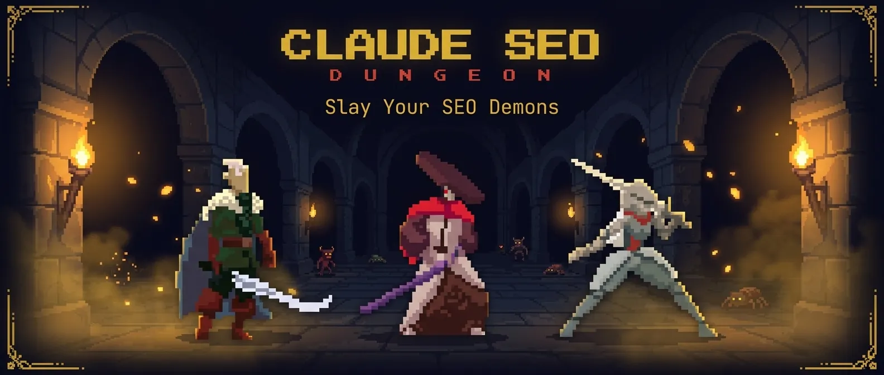
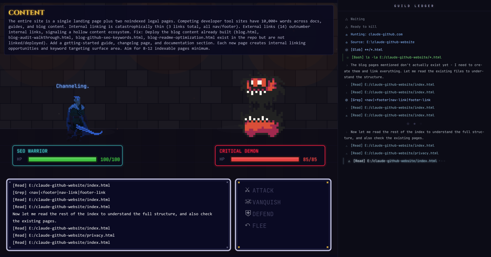

<p align="center">
  
</p>

# Claude SEO Dungeon

A gamified 16-bit dungeon crawler that turns SEO audits into boss battles. Choose your character, descend into the dungeon, and slay your SEO demons one by one.

[](LICENSE)
[](CHANGELOG.md)
[](https://phaser.io/)
[](https://claude.ai/claude-code)

## Screenshots

### Title Screen

*Choose your character, enter a domain, and seal your fate*

### Gate Scene

*Continue a previous quest or begin a new one*

### Dungeon Hall

*Browse SEO demons sorted by severity*

### Battle Scene

*Turn-based combat with real-time Guild Ledger and AI-powered channeling*

## Table of Contents

- [Screenshots](#screenshots)
- [How It Works](#how-it-works)
- [Features](#features)
- [Quick Start](#quick-start)
- [What's Included](#whats-included)
- [Character Classes](#character-classes)
- [Tech Stack](#tech-stack)
- [How the Bridge Works](#how-the-bridge-works)
- [Hackathon Context](#hackathon-context)
- [Troubleshooting](#troubleshooting)
- [Contributing](#contributing)
- [License](#license)

## How It Works

1. **Choose your warrior** - Warrior (Opus), Samurai (Sonnet), or Knight (Haiku)
2. **Enter a domain** - The SEO audit runs via Claude Code, discovering issues as dungeon demons
3. **Explore the dungeon** - Browse discovered SEO issues sorted by severity in the Dungeon Hall
4. **Battle demons** - Turn-based combat with attack, vanquish (AI-powered fix), defend, and flee
5. **Collect loot** - Earn XP and rewards for every demon slain

Each demon represents a real SEO issue found on the target site. The "Vanquish" action channels Claude to generate and apply an actual fix to the codebase.

## Features

- **16-bit pixel art** - Three animated character classes with idle, run, attack, hit, and death sprites
- **Animated demons** - 0x72 DungeonTileset II sprites sized by severity (big demons for critical issues, goblins for info)
- **Procedural sound effects** - 25+ synthesized sounds via Web Audio API (zero audio files)
- **Real SEO analysis** - 17 Claude Code skills + 11 subagents run a full SEO audit pipeline
- **AI-powered fixes** - Channeling mechanic generates real code fixes during battle and commits them to git
- **4K rendering** - DPR-aware canvas scaling (3x minimum) for crisp text on high-DPI displays
- **Atmospheric effects** - Dust motes, embers, ground fog, blood drip transitions, and procedural brick walls
- **Guild Ledger** - Real-time activity log with rich formatting, icons, and typing animations
- **Cinematic transitions** - Fade-to-black sequences, character select sparkle effects
- **Quest caching** - Completed audits are saved locally so you can resume without re-running

## Quick Start

### Prerequisites

- **Node.js 18+**
- **Python 3.10+** (for SEO analysis scripts)
- **[Claude Code](https://docs.anthropic.com/en/docs/claude-code)** installed globally (`npm install -g @anthropic-ai/claude-code`)
- **Git**

### 1. Clone the repo

```bash
git clone https://github.com/avalonreset-pro/claude-seo-dungeon.git
cd claude-seo-dungeon
```

### 2. Install the Claude SEO skills

The repo includes the full **Claude SEO** skill suite (17 skills, 11 subagents). Install them so Claude Code can use them:

**Windows (PowerShell):**
```powershell
.\install.ps1
```

**macOS / Linux:**
```bash
bash install.sh
```

This copies the skills to `~/.claude/skills/` and agents to `~/.claude/agents/`, installs Python dependencies, and optionally sets up Playwright for visual analysis.

### 3. Start the dungeon

```bash
cd dungeon
npm install
npm run dev
```

This starts both the WebSocket bridge server (port 3001) and the Vite dev server (port 3000). Open `http://localhost:3000` in your browser.

### Production Build (recommended)

For smoother performance, especially when screen recording:

```bash
cd dungeon
npm run build
```

Then run the bridge server and static file server:

```bash
# Terminal 1: Bridge server (connects game to Claude Code)
npm run server

# Terminal 2: Optimized static build
npx serve dist -l 3000 -s
```

Open `http://localhost:3000`.

## What's Included

This is a **one-stop-shop** — everything you need is in this repo:

```
claude-seo-dungeon/
  skills/                          # 17 Claude Code SEO skills (bundled)
    seo/                           # Main orchestrator + routing
    seo-audit/                     # Full site audit (spawns 9 parallel agents)
    seo-technical/                 # Technical SEO (crawlability, indexability, etc.)
    seo-content/                   # E-E-A-T and content quality
    seo-schema/                    # Schema.org markup detection/generation
    seo-sitemap/                   # XML sitemap analysis
    seo-images/                    # Image optimization
    seo-geo/                       # AI search / GEO optimization
    seo-local/                     # Local SEO (GBP, citations, reviews)
    seo-maps/                      # Maps intelligence (geo-grid, competitors)
    seo-page/                      # Deep single-page analysis
    seo-plan/                      # Strategic SEO planning
    seo-programmatic/              # Programmatic SEO at scale
    seo-competitor-pages/          # Competitor comparison
    seo-hreflang/                  # International SEO / hreflang
    seo-dataforseo/                # Live data via DataForSEO MCP
    seo-image-gen/                 # AI image generation for SEO assets
  agents/                          # 11 subagents for parallel analysis
  dungeon/                         # The game itself
    index.html                     # Game shell + title screen
    server/index.js                # WebSocket bridge to Claude Code CLI
    src/scenes/                    # Phaser 3 game scenes
    assets/                        # Sprite sheets + pixel art
  install.sh                       # One-command installer (macOS/Linux)
  install.ps1                      # One-command installer (Windows)
```

## Character Classes

| Character | Model | Strengths |
|-----------|-------|-----------|
| **Warrior** | Claude Opus | Maximum analytical depth |
| **Samurai** | Claude Sonnet | Balanced speed and quality |
| **Knight** | Claude Haiku | Fast, efficient combat |

## Tech Stack

- **[Phaser 3](https://phaser.io/)** - 2D game framework
- **[Vite](https://vitejs.dev/)** - Build tool and dev server
- **[Web Audio API](https://developer.mozilla.org/en-US/docs/Web/API/Web_Audio_API)** - Procedural sound synthesis
- **WebSocket (ws)** - Bridge between game UI and Claude Code CLI
- **[Sprite assets by LuizMelo](https://luizmelo.itch.io/)** - Character sprite sheets
- **[0x72 DungeonTileset II](https://0x72.itch.io/dungeontileset-ii)** - Demon sprites

## How the Bridge Works

The game doesn't call the Claude API directly. Instead:

1. The **Phaser game** sends commands over WebSocket to the **bridge server** (port 3001)
2. The bridge server spawns **Claude Code CLI** processes (`claude -p`) with the selected model
3. Claude Code loads the **SEO skills** from `~/.claude/skills/` and runs the audit/fix
4. Results stream back through WebSocket to the game in real-time

This means you use your existing Claude Code login — no API keys to configure.

## Hackathon Context

Built for the Claude Code hackathon. The idea: what if SEO audits weren't boring spreadsheets but dungeon crawls where every issue is a monster you can fight?

The game connects to Claude Code's SEO analysis pipeline through a WebSocket bridge. When you "vanquish" a demon, Claude generates a real fix for the SEO issue and applies it to your codebase.

## Troubleshooting

| Problem | Fix |
|---------|-----|
| "The dungeon is unreachable" | Bridge server isn't running. Run `npm run server` in the `dungeon/` directory |
| Audit hangs or takes forever | Normal for first run (9 parallel agents). Subsequent runs use cached results |
| JSON parse error after audit | Auto-retry is built in. If it persists, try a different model (Sonnet is most reliable) |
| Blurry text on 4K display | Should auto-detect. If not, the game uses 3x minimum DPR |
| Skills not found by Claude | Run the installer (`install.ps1` or `install.sh`) to copy skills to `~/.claude/` |

## Asset Credits

| Asset | Creator | License | Link |
|-------|---------|---------|------|
| Medieval Warrior Pack | LuizMelo | CC0 (Public Domain) | [itch.io](https://luizmelo.itch.io/medieval-warrior-pack) |
| Medieval Warrior Pack 2 | LuizMelo | CC0 (Public Domain) | [itch.io](https://luizmelo.itch.io/medieval-warrior-pack-2) |
| Samurai | LuizMelo | CC0 (Public Domain) | [itch.io](https://luizmelo.itch.io/samurai) |
| 16x16 DungeonTileset II | 0x72 | CC0 (Public Domain) | [itch.io](https://0x72.itch.io/dungeontileset-ii) |
| Dungeon Crawl Stone Soup tiles | DCSS contributors | CC0 (Public Domain) | [github](https://github.com/crawl/crawl) |
| RPG GUI Construction Kit | Lamoot | CC-BY 3.0 | [opengameart.org](https://opengameart.org/content/rpg-gui-construction-kit-v10) |

All sprite assets are used under their respective open licenses. The game code and SEO skills are proprietary.

## Contributing

See [CONTRIBUTING.md](CONTRIBUTING.md) for development setup and guidelines.

## License

[Proprietary](LICENSE) - Copyright (c) 2026 Avalon Reset. All rights reserved.
