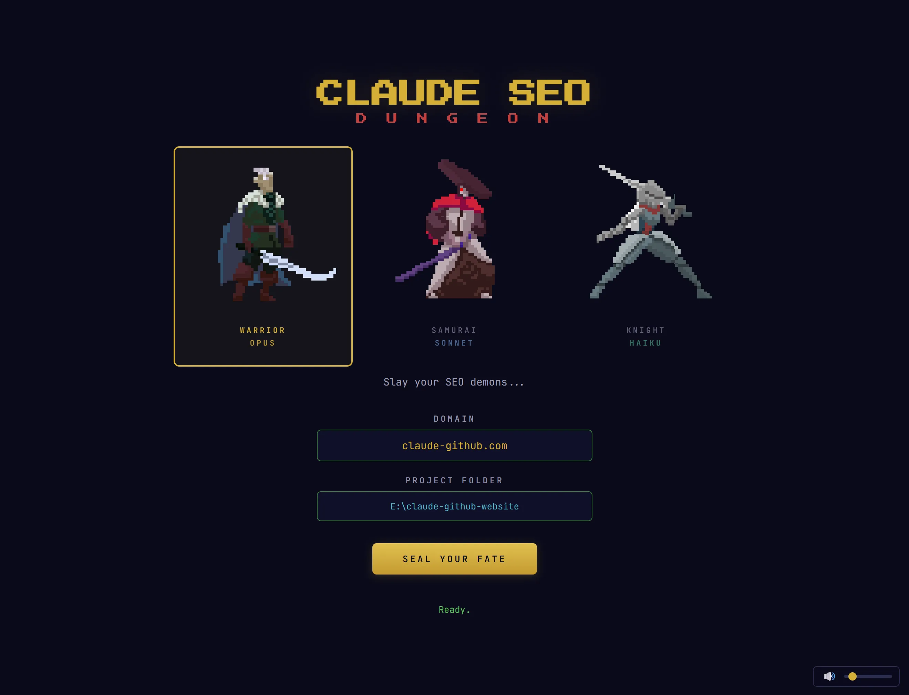
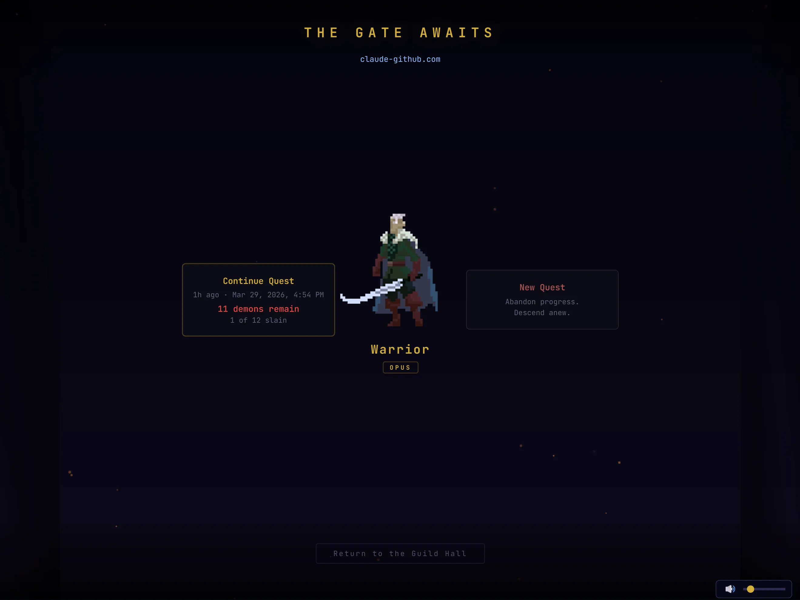
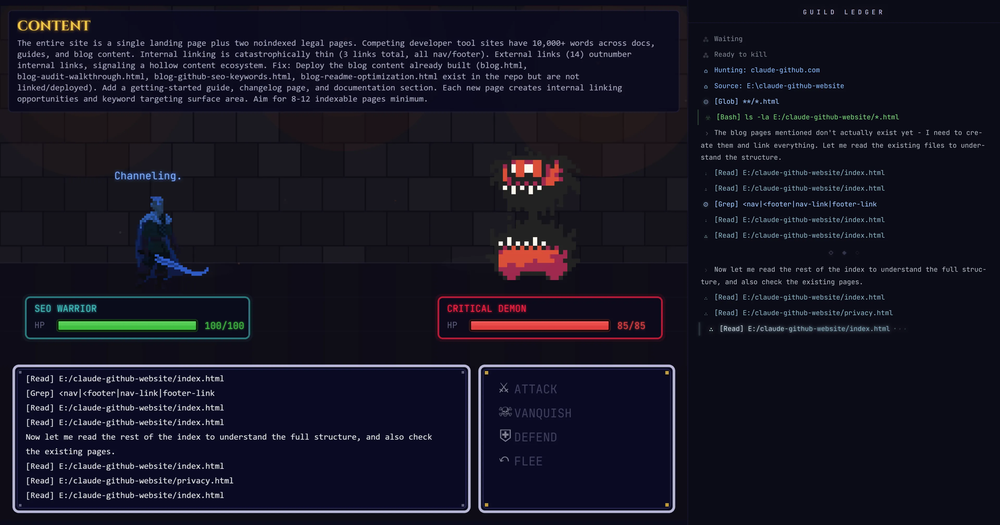

<p align="center">
  
</p>

# Claude SEO Dungeon - Gamified SEO Audit Tool for Claude Code

A gamified 16-bit dungeon crawler that turns SEO audits into boss battles. Built on top of **Claude SEO v1.9.0** (23 skills, 17 subagents, 24 analysis dimensions), this project bundles the entire SEO analysis pipeline into a Phaser.js game where every SEO issue becomes a demon you can fight, and every fix is a real commit to your codebase.

[](https://github.com/avalonreset-pro/claude-seo-dungeon/actions/workflows/ci.yml)
[](LICENSE)
[](CHANGELOG.md)
[](skills/seo/SKILL.md)
[](https://phaser.io/)
[](https://docs.anthropic.com/en/docs/claude-code)

## Screenshots

### Title Screen

*Pick a character class, enter a domain and project path, seal your fate*

### Gate Scene

*Continue a previous quest or begin a new one*

### Dungeon Hall

*Browse SEO demons sorted by severity with flickering torches and ambient particles*

### Battle Scene

*Turn-based combat with real-time Guild Ledger and AI-powered channeling*

## Table of Contents

- [Screenshots](#screenshots)
- [How It Works](#how-it-works)
- [Features](#features)
- [Quick Start](#quick-start)
- [SEO Commands](#seo-commands)
- [What's Included](#whats-included)
- [Character Classes](#character-classes)
- [Extensions](#extensions)
- [How the Bridge Works](#how-the-bridge-works)
- [Tech Stack](#tech-stack)
- [Troubleshooting](#troubleshooting)
- [Asset Credits](#asset-credits)
- [Contributing](#contributing)
- [License](#license)

## How It Works

1. **Choose your warrior** - Warrior (Opus), Samurai (Sonnet), or Knight (Haiku). Each maps to a Claude model.
2. **Enter a domain and project path** - Point the dungeon at any website and its source code.
3. **Descend** - Claude SEO runs a full audit with up to 11 parallel subagents, discovering issues as dungeon demons.
4. **Explore the dungeon** - Browse discovered SEO issues sorted by severity in the Dungeon Hall. Critical issues are deadly bosses. Info-level issues are goblins.
5. **Battle demons** - Turn-based combat with four actions:
   - **Attack** - Deal damage based on the issue's fixability
   - **Vanquish** - Channel Claude to generate and commit a real code fix
   - **Defend** - Reduce incoming damage for a turn
   - **Flee** - Skip this demon and move to the next
6. **Collect loot** - Earn XP and rewards for every demon slain.

Each demon represents a real SEO issue found on the target site. When you choose **Vanquish**, Claude reads your project files, generates a fix, and commits it to git. The Guild Ledger on the right shows everything Claude is doing in real time.

## Features

### Game
- **16-bit pixel art** - Three animated character classes with idle, run, attack, hit, and death sprite animations
- **Animated demons** - 0x72 DungeonTileset II sprites sized by severity (big demons for critical issues, goblins for info)
- **Procedural sound effects** - 25+ synthesized sounds via Web Audio API (zero audio files shipped)
- **4K rendering** - DPR-aware canvas scaling (3x minimum) for crisp text on high-DPI displays
- **Atmospheric effects** - Dust motes, embers, ground fog, blood drip transitions, and procedural brick walls
- **Guild Ledger** - Real-time activity log with rich formatting, icons, and typing animations
- **Cinematic transitions** - Fade-to-black sequences for descending and ascending, character select sparkle effects
- **Quest caching** - Completed audits are saved to localStorage so you can resume without re-running
- **Volume control** - SFX toggle and slider with persistent preferences

### SEO Engine (Claude SEO v1.9.0)
- **17 specialized skills** covering technical SEO, content quality (E-E-A-T), schema markup, image optimization, sitemap architecture, AI search optimization (GEO), local SEO, maps intelligence, and strategic planning
- **11 parallel subagents** that run simultaneously during a full audit for speed
- **Industry detection** - Auto-detects SaaS, e-commerce, local business, publisher, or agency sites
- **AI search optimization** - Analyzes visibility in Google AI Overviews, ChatGPT, and Perplexity
- **AI-powered fixes** - Channeling mechanic generates real code fixes during battle and commits them to git

## Quick Start

### Prerequisites

- **Node.js 18+**
- **Python 3.10+** (for SEO analysis scripts)
- **[Claude Code](https://docs.anthropic.com/en/docs/claude-code)** installed and authenticated
- **Git**

### 1. Clone the repo

```bash
git clone https://github.com/avalonreset-pro/claude-seo-dungeon.git
cd claude-seo-dungeon
```

### 2. Install the Claude SEO skills

The repo bundles the full **Claude SEO v1.9.0** skill suite. The installer copies skills and agents to your Claude Code configuration directory so Claude can use them.

**Windows (PowerShell):**
```powershell
.\install.ps1
```

**macOS / Linux:**
```bash
bash install.sh
```

This does three things:
1. Copies 23 skills to `~/.claude/skills/seo*/`
2. Copies 17 agents to `~/.claude/agents/seo*.md`
3. Installs Python dependencies (for page fetching, screenshots, schema validation)

Playwright is optional but recommended for visual analysis. The installer will prompt you.

### 3. Start the dungeon

```bash
cd dungeon
npm install
npm run dev
```

This starts both the WebSocket bridge server (port 3001) and the Vite dev server (port 3000). Open `http://localhost:3000` in your browser.

### Production Build (recommended)

For smoother performance, especially when screen recording:

```bash
cd dungeon
npm run build
```

Then run the bridge server and static file server:

```bash
# Terminal 1: Bridge server (connects game to Claude Code)
npm run server

# Terminal 2: Optimized static build
npx serve dist -l 3000 -s
```

Open `http://localhost:3000`.

## SEO Commands

The bundled Claude SEO skills also work directly from the Claude Code CLI. You don't need the dungeon game to use them.

```bash
claude
```

Then use any of these commands:

| Command | What It Does |
|---------|-------------|
| `/seo audit <url>` | Full site audit with 9-11 parallel subagents |
| `/seo page <url>` | Deep single-page analysis |
| `/seo technical <url>` | Technical SEO: crawlability, indexability, Core Web Vitals, security |
| `/seo content <url>` | E-E-A-T framework, readability, thin content detection |
| `/seo schema <url>` | Schema.org markup detection, validation, and generation |
| `/seo sitemap <url>` | XML sitemap analysis or generation |
| `/seo images <url>` | Image optimization audit (format, compression, alt text, lazy loading) |
| `/seo geo <url>` | AI search / Generative Engine Optimization (Google AI Overviews, ChatGPT, Perplexity) |
| `/seo local <url>` | Local SEO: GBP, NAP consistency, citations, reviews, map pack |
| `/seo maps [command]` | Maps intelligence: geo-grid rank tracking, GBP audit, competitor radius |
| `/seo plan <type>` | Strategic SEO planning by industry |
| `/seo programmatic` | Programmatic SEO analysis and planning |
| `/seo competitor-pages` | Competitor comparison page generation |
| `/seo hreflang <url>` | International SEO / hreflang audit |
| `/seo image-gen <desc>` | AI image generation for SEO assets (requires Banana extension) |

## What's Included

Everything you need is in this repo. No second install required.

```
claude-seo-dungeon/
  dungeon/                         # The game
    index.html                     # Game shell + title screen UI
    server/index.js                # WebSocket bridge to Claude Code CLI
    src/
      main.js                      # Entry point, transitions, volume control
      knight-sprite.js             # Character select sprite animations
      activity-log.js              # Guild Ledger system
      utils/
        ws.js                      # WebSocket bridge client
        sound-manager.js           # Procedural audio engine (25+ sounds)
      scenes/
        BootScene.js               # Asset loading + DPR setup
        GateScene.js               # Continue/new quest selection
        SummoningScene.js          # Audit progress + animated loading
        DungeonHallScene.js        # Browse demons sorted by impact
        BattleScene.js             # Turn-based combat (~2400 lines)
        VictoryScene.js            # XP rewards + loot drops
    assets/luizmelo/               # Character sprite sheets
  skills/                          # Claude SEO v1.9.0 (23 skills)
  agents/                          # 17 subagents for parallel analysis
  scripts/                         # Python scripts (page fetch, screenshots, schema)
  schema/                          # Schema.org JSON-LD templates
  extensions/                      # Optional add-ons
    dataforseo/                    # Live keyword + SERP data (DataForSEO MCP)
    banana/                        # AI image generation (Nano Banana 2)
  install.sh / install.ps1         # One-command installer
  uninstall.sh / uninstall.ps1     # Clean uninstaller
```

## Character Classes

Each character maps to a Claude model, which affects both the quality of SEO analysis and the speed of combat:

| Character | Model | Analysis Style | Best For |
|-----------|-------|---------------|----------|
| **Warrior** | Claude Opus | Deepest analysis, most thorough fixes | Complex sites, critical audits |
| **Samurai** | Claude Sonnet | Balanced depth and speed | General use, reliable |
| **Knight** | Claude Haiku | Fastest responses, efficient combat | Quick audits, simple sites |

The model selection affects every Claude Code invocation during gameplay, from the initial audit to individual battle actions.

## Extensions

### DataForSEO (live keyword data)

Adds live search volume, keyword difficulty, SERP analysis, and backlink data to the audit pipeline. Requires a [DataForSEO](https://dataforseo.com) account (free tier available).

```bash
# Windows
powershell -File extensions\dataforseo\install.ps1

# macOS/Linux
bash extensions/dataforseo/install.sh
```

### Banana (AI image generation)

Adds AI-generated image creation for SEO assets (Open Graph images, social previews, blog headers) via Nano Banana 2.

```bash
# Windows
powershell -File extensions\banana\install.ps1

# macOS/Linux
bash extensions/banana/install.sh
```

## How the Bridge Works

The game doesn't call the Claude API directly. Instead:

1. The **Phaser game** sends commands over WebSocket to the **bridge server** (port 3001)
2. The bridge server spawns **Claude Code CLI** processes (`claude -p`) with the selected model
3. Claude Code loads the **SEO skills** from `~/.claude/skills/` and runs the audit or fix
4. Results stream back through WebSocket to the game in real-time
5. The **Guild Ledger** displays every tool call, file read, and decision Claude makes

This means you use your existing Claude Code authentication. No API keys to configure (unless you want DataForSEO or Banana extensions).

```
Browser (Phaser.js)  <-->  WebSocket  <-->  Bridge Server  <-->  Claude Code CLI
                                                                    |
                                                              SEO Skills (17)
                                                              Subagents (11)
                                                              Python Scripts
```

## Tech Stack

| Component | Technology | Purpose |
|-----------|-----------|---------|
| Game engine | [Phaser 3](https://phaser.io/) | 2D game framework, scenes, sprites, tweens |
| Build tool | [Vite](https://vitejs.dev/) | Dev server + production bundling |
| Audio | [Web Audio API](https://developer.mozilla.org/en-US/docs/Web/API/Web_Audio_API) | 25+ procedural synthesized sounds |
| Server | Express + ws | WebSocket bridge to Claude Code CLI |
| SEO engine | Claude SEO v1.9.0 | 23 skills, 17 agents, 42 Python scripts |
| Characters | [LuizMelo](https://luizmelo.itch.io/) | Warrior, Samurai, Knight sprite sheets |
| Demons | [0x72](https://0x72.itch.io/dungeontileset-ii) | DungeonTileset II monster sprites |

## Troubleshooting

| Problem | Fix |
|---------|-----|
| "The dungeon is unreachable" | Bridge server isn't running. Run `npm run server` in `dungeon/` |
| Audit hangs or takes forever | Normal for first run (9+ parallel agents). Subsequent runs use cached results |
| JSON parse error after audit | Auto-retry is built in. If it persists, try Sonnet (most reliable for JSON) |
| Blurry text on 4K display | Should auto-detect. The game renders at 3x DPR minimum |
| Skills not found by Claude | Run the installer (`install.ps1` or `install.sh`) to copy skills to `~/.claude/` |
| "No module named playwright" | Playwright is optional. Install with `pip install playwright && python -m playwright install chromium` |
| Bridge port conflict | Default is 3001. Check if another process is using it |

## Asset Credits

| Asset | Creator | License | Link |
|-------|---------|---------|------|
| Medieval Warrior Pack | LuizMelo | CC0 (Public Domain) | [itch.io](https://luizmelo.itch.io/medieval-warrior-pack) |
| Medieval Warrior Pack 2 | LuizMelo | CC0 (Public Domain) | [itch.io](https://luizmelo.itch.io/medieval-warrior-pack-2) |
| Samurai | LuizMelo | CC0 (Public Domain) | [itch.io](https://luizmelo.itch.io/samurai) |
| 16x16 DungeonTileset II | 0x72 | CC0 (Public Domain) | [itch.io](https://0x72.itch.io/dungeontileset-ii) |
| Dungeon Crawl Stone Soup tiles | DCSS contributors | CC0 (Public Domain) | [github](https://github.com/crawl/crawl) |
| RPG GUI Construction Kit | Lamoot | CC-BY 3.0 | [opengameart.org](https://opengameart.org/content/rpg-gui-construction-kit-v10) |

All sprite assets are used under their respective open licenses. See [THIRD-PARTY-NOTICES.md](THIRD-PARTY-NOTICES.md) for full dependency and asset attribution.

## Contributing

See [CONTRIBUTING.md](CONTRIBUTING.md) for development setup and guidelines.

## License

[Proprietary](LICENSE) - Copyright (c) 2026 Avalon Reset. All rights reserved.
